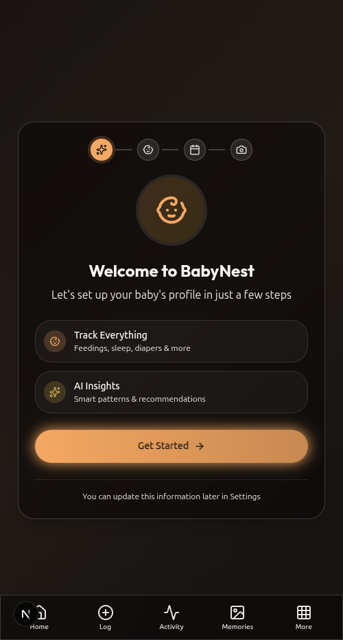
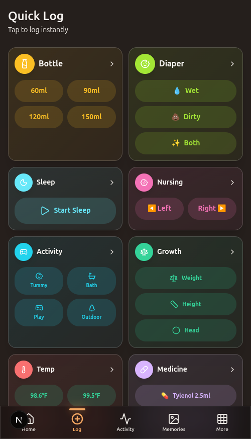
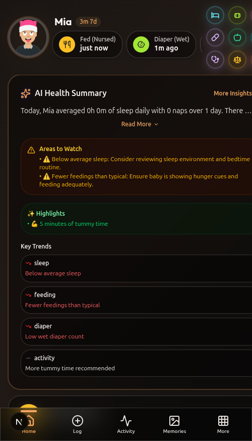
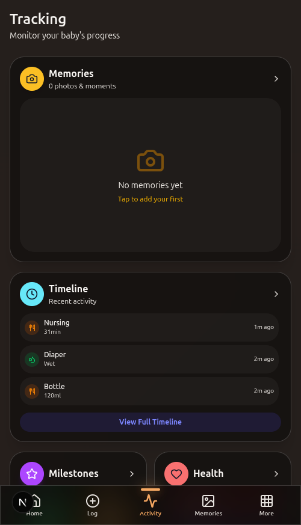
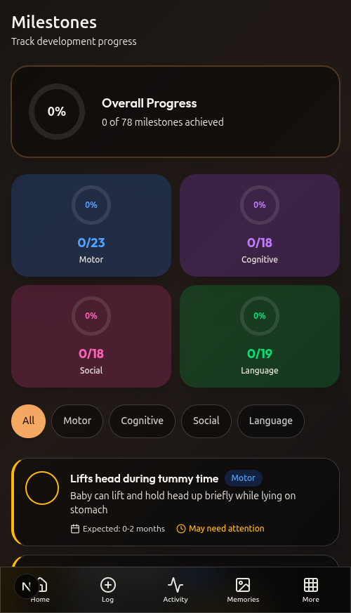
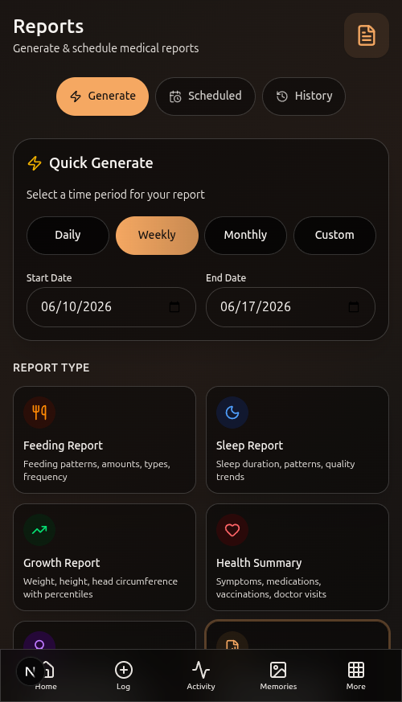

# 🍼 BabyNest — Visual Showcase

A tour of BabyNest, a self-hosted, privacy-first baby tracking app for new parents. Mobile-first PWA: one-tap logging of feeds, sleep, diapers, growth, and health; developmental milestone tracking; local AI-powered insights; and pediatrician-ready reports.

> _Screenshots captured from a local development build (NestJS API + Next.js web + PostgreSQL) at phone-portrait size. Baby profile ("Mia") and activity data are illustrative._

---

## 👋 Onboarding

A guided setup creates your baby's profile in a few steps — name, gender, date of birth, and an optional photo.

---

## ⚡ One-Tap Quick Log

Optimized for one-handed, middle-of-the-night use: log a bottle, diaper, nursing session, sleep, tummy time, growth measurement, temperature, medicine, solids, or symptom in a single tap.

---

## 🏠 Dashboard & AI Health Summary

The home screen shows your baby's age, the latest activities, and a locally-generated **AI Health Summary** — averages, areas to watch, highlights, and key trends across sleep, feeding, diapers, and activity.

---

## 📊 Activity Tracking

A unified timeline of recent activity (nursing, diapers, bottles, …) plus quick views into milestones, health, growth, and activity totals.

---

## 🎯 Developmental Milestones

Track 78 milestones across Motor, Cognitive, Social, and Language domains, each with an expected age range and progress by category.

---

## 📄 Medical Reports

Generate (or schedule) pediatrician-ready reports over daily/weekly/monthly/custom periods — feeding, sleep, growth (with percentiles), health summary, and development reports.

---

## ✨ At a Glance

| Capability | Detail |
|------------|--------|
| **Tracking** | Feeding (bottle/nursing/pump/solids), sleep, diapers, growth, temp, meds, symptoms, activities |
| **Logging** | One-tap quick log, timers, manual entry — one-handed optimized |
| **AI insights** | Local AI health summaries, pattern detection, areas to watch (via Ollama) |
| **Milestones** | 78 milestones across Motor / Cognitive / Social / Language |
| **Reports** | Feeding / sleep / growth / health / development; scheduled & on-demand |
| **Collaboration** | Multi-caregiver with handoff notes |
| **Privacy** | Self-hosted, offline-first with sync, your data stays yours |
| **Stack** | NestJS + Prisma + PostgreSQL + Redis · Next.js 15 + React 19 · Expo (mobile) · Turborepo |

---

_See the [README](README.md) for self-hosting (Docker Compose / Kubernetes) and setup._
